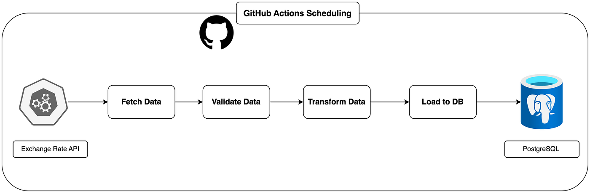

# Architecture – Pipeline ETL Air Quality Index

## Stack technique

### 1. Orchestrateur : GitHub Actions
- **Technologie** : Workflows YAML + crons POSIX (`0 * * * *` pour l’horaire, `0 0 * * *` pour le backfill)
- **Justification** : Serverless, intégré au dépôt, gestion native des secrets, gratuit pour notre volume (2000 min/mois), logs et notifications intégrés.

### 2. Stockage brut : Système de fichiers (Git)
- **Technologie** : Fichiers JSON immuables versionnés dans `raw/`
- **Justification** : Source de vérité infalsifiable, traçabilité Git, rejouabilité, zéro dépendance externe.

### 3. Stockage propre : CSV unique
- **Technologie** : Fichier `air_quality_clean.csv` reconstruit à chaque run dans `clean/`
- **Justification** : Format ouvert, déterministe, facile à valider, contrat de données strict, récupération immédiate.

### 4. Data Warehouse : PostgreSQL (Neon)
- **Technologie** : PostgreSQL cloud (Neon) avec schéma en étoile
- **Justification** : SQL standard, gratuit, haute disponibilité, adapté à la modélisation dimensionnelle, accès permanent pour les requêtes du cours.

---

## Schéma du warehouse 

*(Voir README.md pour les colonnes détaillées et les unités.)*